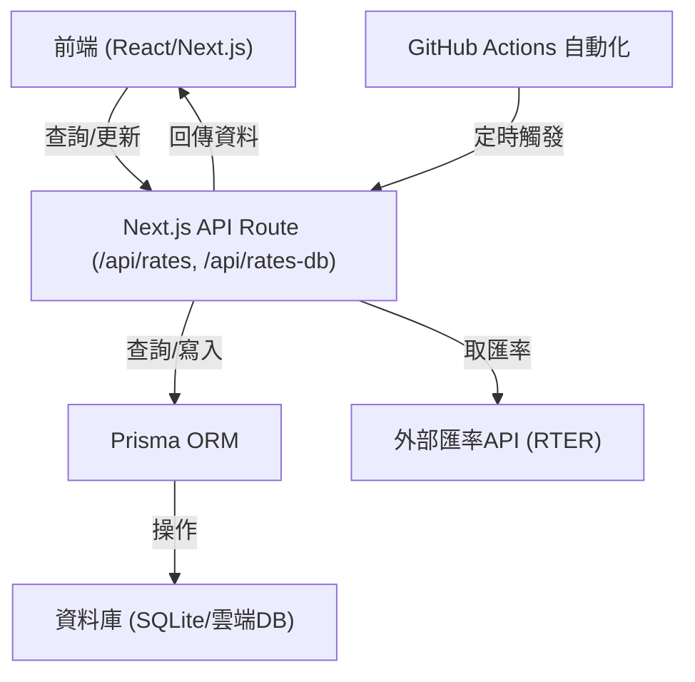

# Rate Now 匯率查詢專案

## 專案架構與後端原理

本專案採用 Next.js + Prisma + SQLite/雲端資料庫，支援自動化匯率更新、API 查詢、現代化 UI/UX，適合雲端 serverless 部署。

### 系統流程圖



---

## 專案詳細架構說明

### 1. 前端（Frontend）

- **技術**：React + Next.js（App Router 架構）
- **樣式**：`styles/globals.css`（Tailwind 為主，部分自訂 CSS）

### 3. 常數與設定（Constants）

- `constants/index.ts`：
  - `CURRENCY_NAME_MAP`：幣別對應中文名稱
  - `SYMBOLS`：幣別符號
  - `CURRENCIES`：支援幣別列表
  - 其他：歷史天數、快取檔案路徑（已棄用）

### 4. 工具與輔助函式（Utils）

- `utils/rateUtils.ts`：匯率計算、API 取得
- `utils/dateUtils.ts`：日期處理
- `utils/cacheUtils.ts`：本地快取（已棄用）
- `utils/remove.ts`：資料清理輔助

### 5. API 後端（Backend / API Routes）

- **Next.js API Routes**（`app/api/`）
  - `/api/rates`：匯率查詢（GET）、自動更新（POST，會抓外部 API 並寫入 DB）
  - `/api/rates-db`：直接查詢/寫入資料庫（GET/POST，for 內部使用）
  - `/api/currencies-list`：回傳支援幣別列表
  - `/api/currency-symbol-map`：回傳幣別符號對照表
- **API 特點**：
  - 完全 RESTful，前後端分離
  - 支援 serverless/cloud 部署
  - 可由 GitHub Actions 定時自動觸發更新

### 6. 資料庫（Database）

- **ORM**：Prisma
- **Schema**：`prisma/schema.prisma`
  - `Rate` 表
    - `id`：流水號
    - `date`：日期（字串）
    - `from`、`to`：幣別
    - `rate`：匯率
    - `createdAt`、`updatedAt`：自動記錄建立/更新時間
    - 複合唯一鍵：`[date, from, to]`
- **預設**：SQLite，建議雲端部署時改用 PostgreSQL/MySQL

### 7. 資料流與自動化

- **GitHub Actions**：定時觸發 `/api/rates`，自動更新資料庫匯率
- **外部 API**：RTER（可替換）

---

This is a [Next.js](https://nextjs.org) project bootstrapped with [`create-next-app`](https://nextjs.org/docs/app/api-reference/cli/create-next-app).

## Getting Started

First, run the development server:

```bash
pnpm dev
```

Open [http://localhost:3000](http://localhost:3000) with your browser to see the result.

You can start editing the page by modifying `app/page.tsx`. The page auto-updates as you edit the file.

This project uses [`next/font`](https://nextjs.org/docs/app/building-your-application/optimizing/fonts) to automatically optimize and load [Geist](https://vercel.com/font), a new font family for Vercel.

## Learn More

To learn more about Next.js, take a look at the following resources:

- [Next.js Documentation](https://nextjs.org/docs) - learn about Next.js features and API.
- [Learn Next.js](https://nextjs.org/learn) - an interactive Next.js tutorial.

You can check out [the Next.js GitHub repository](https://github.com/vercel/next.js) - your feedback and contributions are welcome!

## Deploy on Vercel

The easiest way to deploy your Next.js app is to use the [Vercel Platform](https://vercel.com/new?utm_medium=default-template&filter=next.js&utm_source=create-next-app&utm_campaign=create-next-app-readme) from the creators of Next.js.

Check out our [Next.js deployment documentation](https://nextjs.org/docs/app/building-your-application/deploying) for more details.

## 📄 授權

- 作者：nick-jy-huang
- 本專案部分圖示素材來自 [Flaticon](https://www.flaticon.com/)。
- 本專案 icon 來自 [fontawesome](https://www.fontawesome.com/)。
