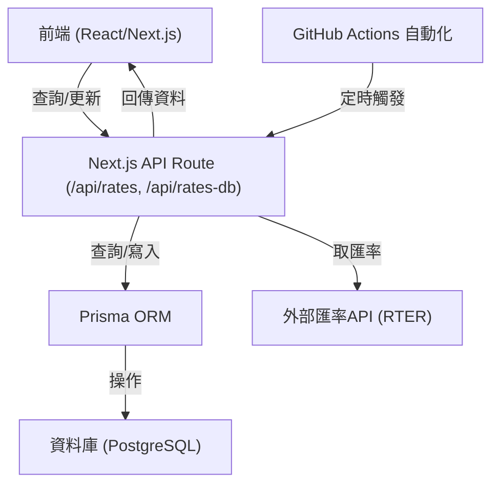

# Rate Now 匯率查詢專案

## 專案架構與後端原理

Next.js + Prisma + PostgreSQL。

### 系統流程圖

---

## 專案詳細架構說明

### 前端（Frontend）

- **技術**：React + Next.js（App Router 架構）
- **樣式**：`styles/globals.css`（Tailwind 為主，部分自訂 CSS）

### 常數與設定（Constants）

- `constants/index.ts`：
  - `CURRENCY_NAME_MAP`：幣別對應中文名稱
  - `SYMBOLS`：幣別符號
  - `CURRENCIES`：支援幣別列表

### API 後端（Backend / API Routes）

- **Next.js API Routes**（`app/api/`）
  - `/api/rates`：匯率查詢（GET）、自動更新（POST，會抓外部 API 並寫入 DB）
  - `/api/rates-db`：直接查詢/寫入資料庫（GET/POST，for 內部使用）
- **API 特點**：
  - 完全 RESTful，前後端分離
  - 可由 GitHub Actions 定時自動觸發更新

### 資料庫（Database）

- **ORM**：Prisma
- **Schema**：`prisma/schema.prisma`
  - `Rate` 表
    - `id`：流水號
    - `date`：日期（字串）
    - `from`、`to`：幣別
    - `rate`：匯率
    - `createdAt`、`updatedAt`：自動記錄建立/更新時間
    - 複合唯一鍵：`[date, from, to]`
- **預設**：PostgreSQL

## 📄 授權

- MIT License
- All images are supported by [Flaticon](https://www.flaticon.com/).
- All icons are provided by [Font Awesome](https://www.fontawesome.com/)
